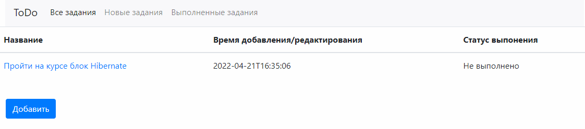

# job4j_todo

Проект служит для составления списка заданий с возможностью их редактирования.

Стек технологий: Spring boot, Thymeleaf, Bootstrap, Hibernate, PostgreSql

Описание:

- На главной странице расположена таблица со списком заданий. 
В таблице отображается имя, дата создания и состояние (выполнено или нет);
- На странице со списком три ссылки: Все, Выполненные, Новые. 

- На странице со списком есть кнопка "Добавить задание".
При нажатии на кнопку переходим на страницу с формой добавления задания

При переходе по ссылкам в таблице отображается: все задания, только выполненные или только новые.

- При клике на задание переходим на страницу с подробным описанием.
- На странице с подробным описанием кнопки: Выполнено, Отредактировать, Удалить.

- Если нажали на кнокпу выполнить, то задание переводиться в состояние выполнено.
- Кнопка редактировать переводит пользователя на отдельную страницу для редактирования

- Кнопка удалить, удаляет задание и переходит на список всех заданий.
